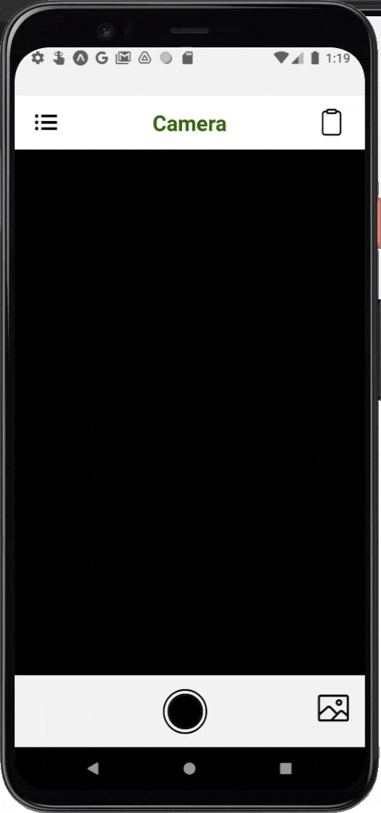

# WhiteBoard
#### This is a project of the course CS307 from Purdue University. 

## Introduction
Modern Coding usually requires a laptop with an IDE (Integrated Development
Environment) or a compiler, but there are many situations where someone must test a
code sample without that code even in a textual format. For example, an interviewee
preparing a coding interview will have to write their code on a piece of paper or on a
whiteboard, and without a compiler, one can only debug by observing their written code
or typing it out in full, a waste of time for all parties involved.

The purpose of this project is to develop a novel “IDE for Written Code” that can support
typeform code or scanning hand-written code, compile the code and return the terminal
output and stack trace back to the user. This application will take the form of a
cross-platform mobile application, and will allow users to save their code images and
organize into teams.

While numerous services provide IDEs/Text editors, Compilers, and OCR services, on a
variety of platforms, there is no single service that integrates all of these. Further, OCR
services that can detect the full ASCII character set are rare and inaccurate. So, we are
confident our application will be well above current trends in providing an effective,
packaged solution!

## Features
- User can send an image of code to the backend server. The server will identify the code, using tesseract-OCR to extract the code, identify its language with guessLang and
execute the code within a docker image. The backend will pipe out the stdout and stderr of the code, indicate where the error is with OpenCV on the original image and return the output to the front-end. User can see the feedback, edit the code and resubmit it.
- User can also create an account and a workspace to invite other users to work together. All users in the same workspace will be able to see the compile request and result of each other. 
- User can restore their password using email service. This feature is not available if not deployed on an AWS instance.

## Demo



## Requrirements
- Everything in the requirement.txt
- Docker
- MySQL
- Expo React-Native for Front-end

## Setup Instruction
- ### Frontend
  - Install Expo React Native. Instructions can be found at https://docs.expo.dev/get-started/installation/
  - After the installation is complete, navigate to the WhiteBoardApp folder and run
  
    ```
    npm start
    ```
    This will start an expo server, which allows you to run the app with expo app on any mobile devices or simulators
  - To export the app into a standalone app, follow the instructions here: https://docs.expo.dev/classic/building-standalone-apps/
- ### Backend / Server
  - Navigate to the Backend folder
  - Install all the required python libraries with
  
    ```
    pip install -r requirement.txt
    ```
  - Install and initiate docker service. To install docker, follow instructions at https://docs.docker.com/engine/install/ubuntu/
  
    To activate local docker service manually:
    
    ```
    sudo systemctl start docker
    ```
  - Install a MySQL server and run a local MySQL server / service. In the MySQL shell, setup a user with full privileges and a database / schema
    according to the database section of the Setting.py
    
    For simplicity, open setting.py and find the database section. Copied the username, password and database name and execute the following scripts in the MySQL shell:
    
    ```
    CREATE USER 'username'@'localhost' IDENTIFIED BY 'password';
    CREATE DATABASE django_data_base;
    GRANT ALL PRIVILEGES ON django_data_base.* TO 'username'@'localhost';
    ```
    After that, exit the MySQL shell and navigate to the directory of manage.py. Update table metadata with command:
    
    ```
    python3 manage.py makemigrations
    python3 manage.py migrate
    ```
    Enter the MySQL shell and double check if the tables are updated.
    
  - To run a local django server, navigate to Backend/WhiteBoardBackEnd/
  
    Run the localhost server with command:
    
    ```
    python3 manage.py runserver localhost:8080
    ```
    To deploy on a server with port forwarding, run the server with command:
    
    ```
    python3 manage.py runserver 0.0.0.0:8080
    ```
    
    
## Note:
- Before compiling the frontend package, please change the common url to the base_url. If you are running on localhost, change it to 

  ```
  const base_url =
  "http://localhost:8080/";  
  ```
  else, change it to your server's domain or IP address with the specific port.
  
- For security issues, Secret keys have been hidden. To run your own server, create a .env file under Backend/WhiteBoardBackEnd/WhiteBoardBackEnd

  To generate a Django secret key, run the following commands in a python3 shell:
  
  ```
  from django.core.management.utils import get_random_secret_key
  
  print (get_random_secret_key())
  ```
  Copy the secret key and in your .env file, write:
  
  ```
  SECRET_KEY = 'key_you_just_copied'
  ```
  Remember to keep the single quote
  
  We also have other AWS secret keys. If you do not intent to deploy on a AWS server, remove these lines in Setting.py:
  
  ```
  AWS_ACCESS_KEY_ID = config("AWS_ACCESS_KEY")  # hidden
  AWS_SECRET_ACCESS_KEY = config("AWS_SECRET_ACCESS_KEY")  # hidden
  ```
  
  However, please note that this will disable the email notification function of this app.

- Due to technical reasons, please allow docker images to run as root. I know it's a dangerous act but for some reason python-docker CLI won't work unless root privileges are provided. 

## Support CI/CD tools
- Simple Jenkins file and Jenkin build script have been provided for basic CI/CD. Feel free to modify this part for a better integration process. 
